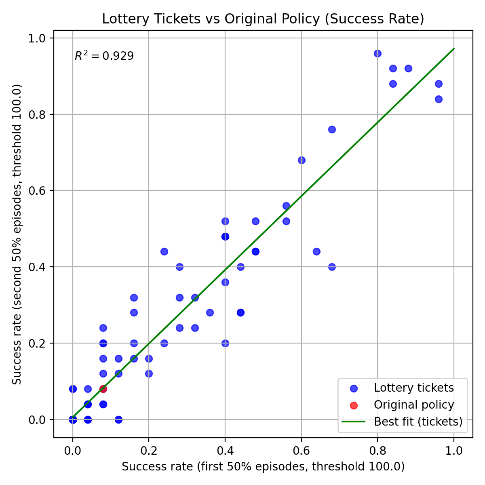
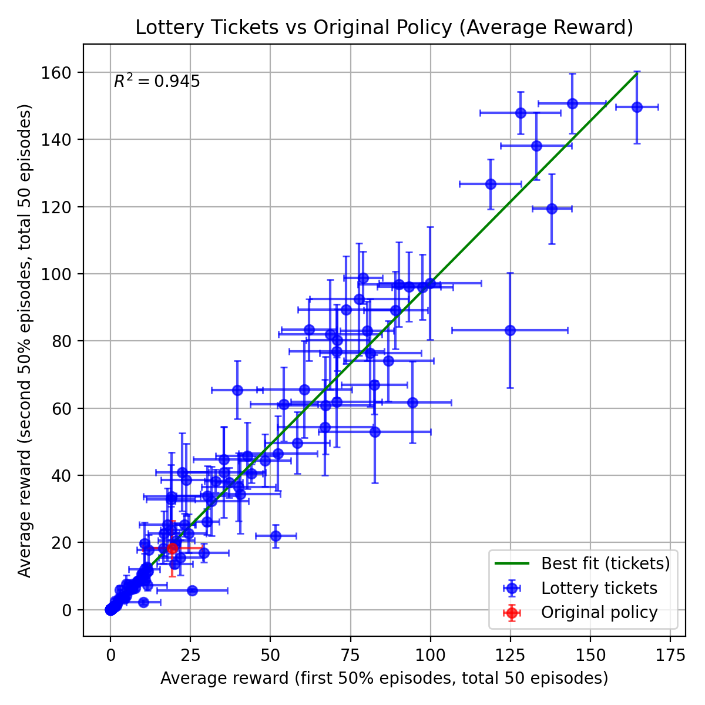

# 🎫 The Lottery Ticket Hypothesis for Improving Pretrained Robot Diffusion and Flow Policies 
<table>
  <!-- Header row -->
  <tr>
    <th align="center">Original Policy (i.e: Initial noise sampled from gaussian)</th>
    <th align="center">🎫 Golden Ticket (i.e: Optimized fixed initial noise)</th>
  </tr>

  <!-- FrankaSim row -->
  <tr>
    <td align="center">
      
    </td>
    <td align="center">
      
    </td>
  </tr>

  <!-- LIBERO row -->
  <tr>
    <td align="center">
      
    </td>
    <td align="center">
      
    </td>
  </tr>

  <!-- Robomimic row -->
  <tr>
    <td align="center">
      
    </td>
    <td align="center">
      
    </td>
  </tr>


  <!-- Caption -->
  <tr>
    <td colspan="3" align="center">
      <em>
(left) Baseline policy (Gaussian sampling) vs. (right) 🎫 golden-ticket policy using a fixed initial noise. (top) is frankasim, (middle) is 🤗 SmolVLA + LIBERO, (bottom) is <a href="https://github.com/irom-princeton/dppo">DPPO for robomimic</a>. Each row uses a different golden ticket that was optimized for that model.
      </em>
    </td>
  </tr>
</table>


This is a repository for testing the lottery ticket hypothesis for robot control. There are three different experimental setups, where each experiment uses a unique simulation and policy class:
1. [franka-sim cube picking with state-based flow matching policies](#franka-sim-lottery-ticket-examples)
2.  [🤗 LeRobot pretrained 🤗SmolVLA for LIBERO](#smolvla-for-libero-lottery-ticket-examples)
3. [DPPO for robomimic](#dppo-for-robomimic-lottery-ticket-examples)

[🦾 Franka-sim](#franka-sim-lottery-ticket-examples) involves a cube picking task with a franka robot, where the cube randomly spawns in a ~1/2 square meter region in front of the robot. Our codebase includes an automated way to generate demonstrations, training code for behavior cloning with a flow matching policy on the collected data, and model checkpoints of policies we have already trained. We also include golden tickets for the checkpoints we provide. This is a great experimental testbed if you'd like to examine all parts of a pipeline (data collection, policy training, and inference) that result in policies with golden tickets. The small model makes it easier to do experiments with little compute. The policy and training code is all custom-written.

[🤗 SmolVLA + Libero](#smolvla-for-libero-lottery-ticket-examples) represents an experiment where a pretrained VLA checkpoint is taken (directly from LeRobot), and golden tickets are searched for over a multitude of task suites. We also include golden tickets we have found which can be evaluated. This is a good experimental testbed for examining lottery tickets with an open-source VLA, and on a multi-task setting. The policy used in our experiments comes from an off-the-shelf LIBERO checkpoint from LeRobot, so this reflects looking for lottery tickets in a model we didn't create. 

[✨ DPPO for robomimic](#dppo-for-robomimic-lottery-ticket-examples) includes the original DPPO robomimic checkpoints used in the DSRL project. We provide golden tickets for these policies, and code for generating new tickets and comparing against the base policy. 

# Franka-sim Lottery Ticket Examples 

## Setup
```
# Clone the repo and go into it.
git clone https://github.com/rai-inst/lottery_tickets.git
cd lottery_tickets

# Setup uv venv and install franka-sim
uv sync --extra franka-sim
# source the venv
source .venv/bin/activate

# Go into the  franka_sim_lt folder
cd src/lottery_tickets/franka_sim_lt/

# It helps to set `MUJOCO_GL` to use gpu rendering for faster performance:
export MUJOCO_GL=egl
```

The codebase supports the following:
1. [Flow matching policies already trained that you can evaluate](#evaluating-pretrained-flow-matching-policy)
2. [Generating a new lottery ticket for franka-sim](#generating-a-new-lottery-ticket-for-franka-sim)
3. [Evaluating an existing franka-sim lottery ticket](#evaluating-an-existing-franka-sim-lottery-ticket)
4. [Visualize ticket and original policy performance](#visualize-ticket-and-original-policy-performance)
5. [Generate data and train your own base policy](#generate-data-and-train-your-own-base-policy)

##  Evaluating pretrained flow matching policy
First, go into `train_model` folder, and download a checkpoint (TODO: Make this accessible to public)
```
cd train_model
gsutil -m cp -r  "gs://bdai-common-storage/lottery_tickets/checkpoints"  .
```

You can run an evaluation on that checkpoint by running `evaluate.py` and setting `evaluation.model_path` to your chosen checkpoint. For these examples, consider the ckpt `fm_seed_1001`.

```
python evaluate.py evaluation.model_path=checkpoints/fm_seed_1001/checkpoints/fm_policy_final.pt +original_policy=True
```

You will see the policy's total rewards for each episode get printed out. This policy typically has an average episode reward of ~17, whereas success normally is >80. It on occasion succeeds, slowly, but most of the time it is not a good policy. 

## Generating a new lottery ticket for franka-sim
You can generate a new lottery ticket and evaluate it by setting `new_noise=True`. It'll run similarly to the previous script, except an initial noise will be chosen at the start, used for all episodes, and then saved as `init_x.pt` in the same folder as the videos folder. Run the script to grab a lottery ticket and see if you win!

```
python evaluate.py evaluation.model_path=checkpoints/fm_seed_1001/checkpoints/fm_policy_final.pt +new_noise=True
```

If you'd like to generate a large number of tickets, you can run the following bash script (TODO: Put options for passing checkpoint, output dir, num episodes, etc. as arguments for bash script, or just edit evaluate.py to do loop more effeciently). This will generate a folder that will contain subdirs, each subdir representing the results of a ticket:

```
bash generate_tickets.sh
```


## Evaluating an existing franka-sim lottery ticket
You can evaluate the saved `init_x.pt` of a model by passing a path as an argument to the script via `noise_path` parameter. For example, you can download a golden ticket for `fm_seed_1001` checkpoint (and the other checkpoints) we've found via:

```
gsutil -m cp -r "gs://bdai-common-storage/lottery_tickets/golden_tickets" .
```

Now you can evaluate the golden tickets, for example:

```
python evaluate.py evaluation.model_path=checkpoints/fm_seed_1001/checkpoints/fm_policy_final.pt +noise_path=./golden_tickets/fm_seed_1001/init_x.pt 
```

This golden ticket typically averages at least above 100, which is normally a success. It does still occassionaly fail, but it is much more reliable than the original policy. 

## Visualize ticket and original policy performance
You can visualize the results in a 2D scatter plot, where the x-axis represents the rewards/success rate for the first 50% episodes, and the y-axis is the rewards/success rate for the second 50% episodes. The more linear this is, the more predictable performance of a golden ticket on a set of environment states generalize to others. To help with checking for this linearity, our graph includes a best-fit line along with r^2 value. Also, if the results of the original policy are also in the folder (and named `original_policy`), then it will be added to the plot with specialized coloring to compare tickets and original policy performance.

The script also prints out the tickets in order of their average episode rewards and task success rate, along with the original policy's at the top.

```
python viz_regression_to_mean.py --root_dir=./outputs/fm_seed_1001_lottery_ticket_search --out_avg=scatter_fm_seed_1001_rewards.png --out_success=scatter_fm_seed_1001_success.png --threshold=100
```

Here is an example output we got when running the script on `fm_seed_1001`. As can be seen by the line of best fit and the r^2 value, the performance of the tickets on the first set of episodes is highly predictive of its performance on the other episodes. Also, we can see that while the base policy (red) has low performance, there are many tickets (blue) that are much better, dramatically increasing base policy performance from ~15% to high ~90% success rate.

<table align="center">
  <tr>
    <td></td>
    <td></td>
  </tr>
  <tr>
    <td align="center"><em>Success rates for tickets and base policy (`fm_seed_1001`)</em></td>
    <td align="center"><em>Episode rewards for tickets and base policy (`fm_seed_1001`)</em></td>
  </tr>
</table>


## Generate data and train your own base policy
You can generate demonstration data and train your own policy, in case you'd like to experiment with different parts of the pipeline to investigate what causes golden tickets to occur.

First, you can generate expert data by running the following script:

```
cd generate_data
python generate_data.py
```

This will use a task and motion planning algorithm to generate demonstrations of the franka picking up the cube. By default, the script will run until it has collected 1000 succesful demos. All of the saved data will be placed in the `outputs` folder by default. There will be a pickle file `demos.pkl` that contains all the demonstrations and will be used for training.

You can also download the data we used to train our checkpoints here if you'd prefer not to generate your own data:

```
gsutil -m cp -r "gs://bdai-common-storage/lottery_tickets/data" .
```


Now we can train a policy with the data by using the train script inside `train_model`, and passing the path to `demo.pkl` to the `dataset.data_path` parameter. For example:

```
cd train_model
python train.py dataset.data_path=/PATH/TO/demos.pkl
```

This will print out the average loss per epoch, and save checkpoints along the way to `outputs/policy`. The last checkpoint will be saved as `fm_policy_final.pt`, although you can use any of the checkpoints saved along the way.

You can [evaluate your newly trained checkpoint](#evaluating-pretrained-flow-matching-policy) in the same way as before, or you can [search for golden tickets](#generating-a-new-lottery-ticket-for-franka-sim).


# SmolVLA for LIBERO Lottery Ticket Examples

For the pretrained policy weights in our experiments, we use <a href="https://huggingface.co/HuggingFaceVLA/smolvla_libero">LeRobot's finetuned version of SmolVLA for LIBERO: "HuggingFaceVLA/smolvla_libero" </a>. 

There are 5 libero environments you can use as your env.task:
- libero_object
- libero_spatial
- libero_goal
- libero_90
- libero_10

We have a python script (pretty much exact copy of `lerobot_eval.py`) you can run that can be used in 1 of 3 ways:
1. [Generate a new lottery ticket (i.e: get performance on a task suite)](#generating-a-new-ticket)
2. [Evaluate a saved lottery ticket on other tasks](#evaluating-a-saved-ticket)
3. [Running the original policy](#running-the-original-policy)
4. TODO: Visualize the results

## Setup

```
# Clone the repo and go into it.
git clone https://github.com/rai-inst/lottery_tickets.git
cd lottery_tickets

# Make and activate conda environment.
conda create -n lottery_tickets python=3.10
conda activate lottery_tickets

# Install package with smolvla + libero dependencies
pip install -e .[smolvla-libero]

# It helps to set `MUJOCO_GL` to use gpu rendering for faster performance:
export MUJOCO_GL=egl

# Go into the `smolvla_libero` directory
cd src/lottery_tickets/smolvla_libero
```

## Generating a new ticket

Set `eval_mode=NEW_TICKET` to generate a new noise vector (it will be sampled from standard normal), and run `n_episodes` of eval on it for the `env.task` list. You can set the seed for the environments by passing `seed` parameter an integer argument (`1000` is the default value). The noise vector will be saved to `{output_dir}/{A_UNIQUE_ID}/initial_noise.pt` for future use, along with videos and results. 

```
python evaluate.py \
        --policy.path="HuggingFaceVLA/smolvla_libero" \
        --env.type=libero \
        --env.task=libero_spatial \
        --eval.batch_size=1 \
        --eval.n_episodes=1 \
        --output_dir=outputs/libero_spatial_tickets \
        --eval_mode=NEW_TICKET \
        --seed=1000
```

## Evaluating a saved ticket

Set `eval_mode=LOAD_TICKET` and load a ticket by passing `initial_noise.pt` into `noise_path`. We can change the seed too to rollout on different environment seeds.

```
python evaluate.py \
        --policy.path="HuggingFaceVLA/smolvla_libero" \
        --env.type=libero \
        --env.task=libero_spatial \
        --eval.batch_size=1 \
        --eval.n_episodes=1 \
        --output_dir=outputs/eval_libero_spatial_tickets/ticket_results \
        --eval_mode=LOAD_TICKET \
        --noise_path=PATH/TO/initial_noise.pt \
        --seed=100000
```

## Running the original policy

Set `eval_mode=ORIGINAL_POLICY`, and the original policy (i.e: sampling from gaussian at all steps) will be evaluated. Results and videos will be saved, but there will be noise `initial_noise.pt` saved since it's not used. 

```
python evaluate.py \
        --policy.path="HuggingFaceVLA/smolvla_libero" \
        --env.type=libero \
        --env.task=libero_spatial \
        --eval.batch_size=1 \
        --eval.n_episodes=1 \
        --output_dir=outputs/libero_spatial_tickets \
        --eval_mode=ORIGINAL_POLICY \
        --seed=1000
```


# DPPO for robomimic Lottery Ticket Examples
The original DPPO paper released state-based diffusion policy checkpoints for robomimic tasks. These checkpoints were used in the original DSRL set of experiments. We use these same model checkpoints and show the existence of golden tickets.

We have scripts for:
1. [Generating new tickets using a base policy](#generate-tickets-with-dppo-robomimic)
2. [Evaluate the default dppo robomic policy](#evaluate-the-default-dppo-robomic-policy)

## Setup
```
# Clone the repo and go into it.
git clone https://github.com/rai-inst/lottery_tickets.git
cd lottery_tickets
# Create and activate python3.10 conda env, then install robomimic + dppo dependencies 
# TODO: simplify the dependencies, not sure we need the stable-baselines for basic results?
conda create -n dppo_robomimic python=3.10 -y
conda activate dppo_robomimic
pip install -e .[dppo-robomimic]

# Setup DPPO
# TODO: See if we can add this to `dppo-robomimic` optional dependency setup and still have everything work nicely
cd src/lottery_tickets/robomimic_dppo_lt
git clone https://github.com/ajwagen/dppo-dsrl.git dppo
cd dppo
pip install -e .[gym,robomimic]
# go back to main directory.
cd ..
```

## Download pretrained dppo robomimic checkpoints

To download the pretrained DPPO model checkpoints, <a href="https://drive.google.com/drive/folders/1kzC49RRFOE7aTnJh_7OvJ1K5XaDmtuh1">download this folder</a> and place it in your `dppo/log` folder. This is directly lifted from <a href="https://github.com/ajwagen/dsrl?tab=readme-ov-file#installation">the original DSRL codebase</a>.

## Generate tickets with dppo robomimic
Randomly sample `noise_samples` tickets (noises from a Gaussian) and evaluate them over `n_envs` fixed set of environments. Results are logged to `out`. You can pass `--save-vid` to save videos for all tickets on all environments, but normally only recommended for n_envs < 10 for debugging purposes. 

```
python lottery_ticket.py --task_name can --n_envs 3 --noise_samples 5 --seed 999 --out "logs_res_rm/lottery_ticket_results/" --ddim_steps 8 --no_wandb --save_vid
```

## Evaluate the default dppo robomic policy
We can evaluate the base policy performance (i.e: sampling from gaussian) with a similar script. 

```
python dppo_base_eval.py --task_name can --n_evals_per_seed 100 --n_seeds 5 --seed 1619 --out "logs_res_rm/policy_eval/" --ddim_steps 8 --save_vid
```

## Evaluate golden tickets for dppo robomimic
<a href="https://drive.google.com/drive/folders/1GCtMUE3bylCTIZb_zQYgCxVcrj_Phl3-">You can download a folder containing golden tickets for can here</a>. You can then run the following script to evaluate the golden tickets on different environment states by passing the directory path to `eval` parameter. The folder contains multiple tickets, ranked by their performance, so you can use `eval_idx` to select which ticket to run, with `0` representing the best golden ticket. 


```
python opt_noise.py \
--eval ./envs100_samples5000_seed999_ddim8_20251130_221846_ddim8 \
--eval_idx 0 \
--task_name can \
--n_evals_per_seed 3 \
--n_seeds 5 \
--seed 1619 \
--out "logs_res_rm/noise_eval_results/" \
--ddim_steps 8 \
--save_vid
```